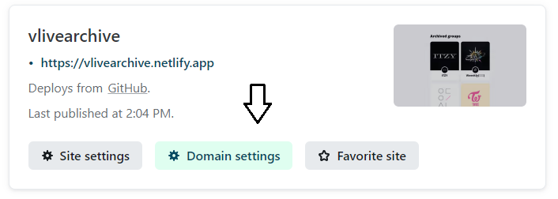
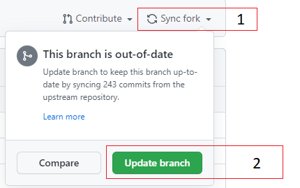

1. Sign up for a free account on GitHub: https://github.com/
2. Go to https://github.com/jonathanlam/vlive-frontend and click "Fork".

3. Sign up for a free account on Netlify: https://app.netlify.com/.
4. When you get to the "Deploy your first project" page, click "Import from Git".
5. Sign in with your GitHub account.
6. When you get to the "Import an existing project from a Git repository" choose the "vlive-frontend" repository.
7. Leave the site settings as the default branch (main). Click on "Deploy site".
8. Click on "domain settings" to enter a custom subdomain or custom domain.

Whenever an update comes out, you will need to "pull" the latest update into your own fork.
Go to github.com/youraccount/vlive-frontend and click on "Sync fork" and "Update branch".

Netlify should automatically deploy the latest version.
